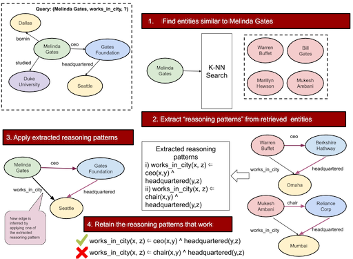

Code for the AKBC'20 paper -- [A Simple Approach to Case-Based Reasoning in Knowledge Bases](https://openreview.net/forum?id=AEY9tRqlU7)



## Setup
### Download the experiment data from [here](http://iesl.cs.umass.edu/downloads/cbr-akbc-data), untar it in the root directory of the project.
The compressed size is ~401M and uncompressed size is ~716M. 
```bash
wget  http://iesl.cs.umass.edu/downloads/cbr-akbc-data/cbr-akbc-data.tar.gz && tar xvf cbr-akbc-data.tar.gz
```
```
cd cbr-akbc-data && export PYTHONPATH=`pwd`
```

### To reproduce results from the paper, run the following:

```
WN18RR
python code/cbr.py --dataset_name WN18RR --test --k_adj 5 --max_num_programs 25

Sample output

[2020-06-30 01:48:46     Avg number of programs 22.41]
[2020-06-30 01:48:46     Avg number of answers after executing the programs: 88.83012354651163]
[2020-06-30 01:48:46     Accuracy (Loose): 0.6043395022335674]
[2020-06-30 01:48:46     Hits@1 0.3940650925335035]
[2020-06-30 01:48:46     Hits@3 0.4610721123165284]
[2020-06-30 01:48:46     Hits@5 0.4834077855775367]
[2020-06-30 01:48:46     Hits@10 0.5113273771537971]
[2020-06-30 01:48:46     MRR 0.4353462886214267]
[2020-06-30 01:48:46     Avg number of nn, that do not have the query relation: 0.0]
[2020-06-30 01:48:46     Avg num of returned nearest neighbors: 4.8146]
[2020-06-30 01:48:46     Avg number of programs that do not execute per query: 9.7958]
``` 

```
FB122

Sample output

python code/cbr.py --dataset_name FB122 --test --max_num_programs 5 --k_adj 5 --test_file_name testI.txt

[2020-06-30 02:34:09     Avg number of programs 84.18]
[2020-06-30 02:34:09     Avg number of answers after executing the programs: 239.20991083174974]
[2020-06-30 02:34:09     Accuracy (Loose): 0.7875791139240507]
[2020-06-30 02:34:09     Hits@1 0.30205655526992287]
[2020-06-30 02:34:09     Hits@3 0.4240656515720783]
[2020-06-30 02:34:09     Hits@5 0.4712280007909828]
[2020-06-30 02:34:09     Hits@10 0.5152264188253906]
[2020-06-30 02:34:09     MRR 0.37816693679851926]
[2020-06-30 02:34:09     Avg number of nn, that do not have the query relation: 0.0]
[2020-06-30 02:34:09     Avg num of returned nearest neighbors: 4.9895]
[2020-06-30 02:34:09     Avg number of programs that do not execute per query: 3.0440]

```

```
NELL-995

Sample output

ppython code/cbr.py --dataset_name NELL-995 --test --max_num_programs 15 --k_adj 5

[2020-06-30 01:56:20     Avg number of programs 61.63]
[2020-06-30 01:56:20     Avg number of answers after executing the programs: 104.97333848531684]
[2020-06-30 01:56:20     Accuracy (Loose): 0.927787610619469]
[2020-06-30 01:56:20     Hits@1 0.7044247787610619]
[2020-06-30 01:56:20     Hits@3 0.832212389380531]
[2020-06-30 01:56:20     Hits@5 0.8552212389380531]
[2020-06-30 01:56:20     Hits@10 0.8792920353982301]
[2020-06-30 01:56:20     MRR 0.7728688225565385]
[2020-06-30 01:56:20     Avg number of nn, that do not have the query relation: 0.0]
[2020-06-30 01:56:20     Avg num of returned nearest neighbors: 5.0000]
[2020-06-30 01:56:20     Avg number of programs that do not execute per query: 17.6631]

```

### To run for a new dataset, first a random subgraph around each entity needs to be collected and written to disk.
### In our experiments, we just collect 1000 random paths aorund each entity by doing DFS.
```
python code/data/get_paths.py --dataset_name <insert_dataset_name> --num_paths_to_collect 1000 --data_dir cbr_akbc_data
```

### Citation
````
@inproceedings{cbr_akbc,
  title = {A Simple Approach to Case-Based Reasoning in Knowledge Bases},
  author = {Das, Rajarshi and Godbole, Ameya and Dhuliawala, Shehzaad and Zaheer, Manzil and McCallum, Andrew},
  booktitle = {AKBC},
  year = 2020
}
````
 
